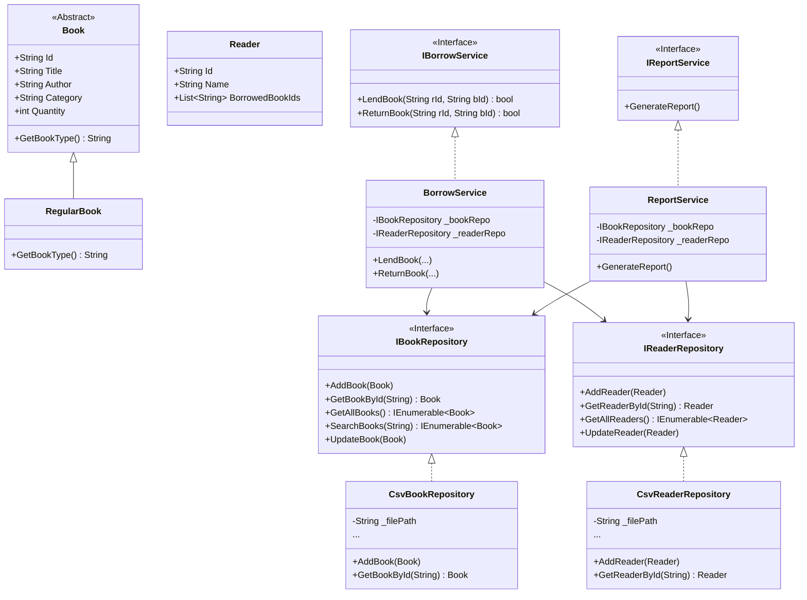

# Library Management System - Design & Implementation Report

**Course**: CSE 422 - Coding Practice  
**Assignment**: Lab 4 - SOLID Principles

## 1. System Analysis and Design

### UML Class Diagram

### Class Roles

- **Book (Abstract)**: Represents the core data of a book.
- **RegularBook**: Concrete implementation of a book.
- **Reader**: Represents a library user.
- **Repositories (CSV)**: Handle data persistence (CRUD) to CSV files.
- **BorrowService**: Handles the business logic for lending and returning rules (stock limits, borrow limits).
- **ReportService**: Handles the logic for generating output summaries.

---

## 2. Application of SOLID Principles

The system was explicitly designed to follow SOLID principles:

1.  **Single Responsibility Principle (SRP)**:
    - Each class has a single purpose.
    - `Book` and `Reader` are pure data models.
    - `CsvBookRepository` handles _only_ data access for books (reading/writing files). It does not handle business logic like "can this user borrow?".
    - `BorrowService` contains the rules for borrowing (limit 3, stock check). It does not know how to safe data to a file.
    - `ReportService` only formats and displays data.

2.  **Open/Closed Principle (OCP)**:
    - The system is open for extension but closed for modification.
    - **New Book Types**: `Book` is abstract. We can add `EBook` or `Magazine` by subclassing `Book` without changing `BorrowService` or `ReportService`.
    - **New Storage**: Depending on interfaces (`IBookRepository`), we can switch to a Database repository without changing the Service logic.

3.  **Liskov Substitution Principle (LSP)**:
    - Any subclass of `Book` (e.g., `RegularBook`) can be used wherever `Book` is expected.
    - The repositories return `IEnumerable<Book>`, allowing any derived type to be processed by services seamlessly.

4.  **Interface Segregation Principle (ISP)**:
    - Interfaces are focused. `IBorrowService` only has `Lend` and `Return`. It doesn't include "Generate Report" or "Add Book". This prevents clients from depending on methods they don't use.
    - `IReportService` is separate from `IBorrowService`.

5.  **Dependency Inversion Principle (DIP)**:
    - High-level modules (`BorrowService`, `ReportService`, `Program.cs`) do not depend on low-level modules (`CsvBookRepository`). Both depend on abstractions (`IBookRepository`).
    - This allows us to inject the CSV implementation in `Program.cs` while the rest of the app remains agnostic of the storage mechanism.

---

## 3. Extensibility & Future Improvements

### Supporting New Book Types (e.g., eBooks)

To add eBooks:

1.  Create `class EBook : Book` in the `Models` namespace.
2.  The `BookFactory` uses **Reflection** to automatically detect and instantiate any subclass of `Book` by name. **No modification to the Factory or existing code is required.**
3.  The rest of the system (Borrowing, Reporting) works automatically because they operate on the `Book` abstraction.

### Supporting New Requirements (e.g., Reservations)

1.  Create a new interface `IReservationService`.
2.  Implement `ReservationService`.
3.  Inject it where needed. This ensures we don't clutter `BorrowService` with reservation logic.

### Database Migration

Since the services depend on `IBookRepository`, we can implement `SqlBookRepository : IBookRepository` and swap it in `Program.cs` without rewriting any business logic.
